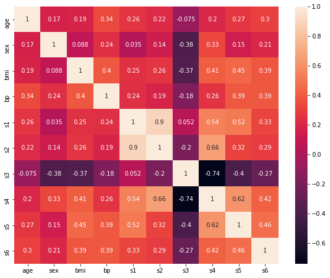
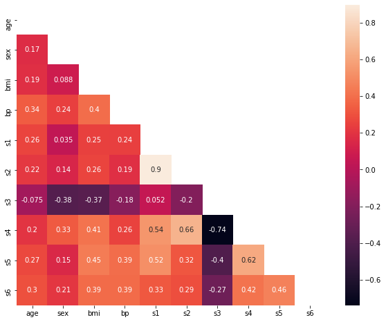

```python
# Importing the useful library
import pandas as pd
import numpy as np

import matplotlib.pyplot as plt
import seaborn as sns

# We will use diabetes dataset in this example
from sklearn.datasets import load_diabetes
```


```python
#Extracting data from the bunch of load_diabetes function
diabetes = load_diabetes()

#We extract features from the dataset which is numpy array thus we convert that to pandas DataFrame.
X = pd.DataFrame(data = diabetes['data'], columns = diabetes['feature_names']) 
```


```python
# Calculating Correlation matrix and viewing the matrix
X_corr = X.corr()

print(X_corr)
```

              age       sex       bmi  ...        s4        s5        s6
    age  1.000000  0.173737  0.185085  ...  0.203841  0.270777  0.301731
    sex  0.173737  1.000000  0.088161  ...  0.332115  0.149918  0.208133
    bmi  0.185085  0.088161  1.000000  ...  0.413807  0.446159  0.388680
    bp   0.335427  0.241013  0.395415  ...  0.257653  0.393478  0.390429
    s1   0.260061  0.035277  0.249777  ...  0.542207  0.515501  0.325717
    s2   0.219243  0.142637  0.261170  ...  0.659817  0.318353  0.290600
    s3  -0.075181 -0.379090 -0.366811  ... -0.738493 -0.398577 -0.273697
    s4   0.203841  0.332115  0.413807  ...  1.000000  0.617857  0.417212
    s5   0.270777  0.149918  0.446159  ...  0.617857  1.000000  0.464670
    s6   0.301731  0.208133  0.388680  ...  0.417212  0.464670  1.000000
    
    [10 rows x 10 columns]
    


```python
# We now create a heatmap based on the above correlation matrix.
plt.subplots(figsize = (10, 8))
sns.heatmap(data = X_corr, annot = True) # Note, annot = True will display the correlation value in heatmap
plt.show()
```





Did you notice that the upper triangle and lower trianger displays the same information in correlation matrix and heatmap shown above? 

Okay, let's optimize our heatmap now.We can either create upper or lower trainagular heatmap. For our comfortability, I am here showing lower triangular heatmap and it's lot easier to analyze.


```python
#Create a numpy boolean matrix with same size as correlation matrix
np.ones(X_corr.shape, dtype = bool)
```


    array([[ True,  True,  True,  True,  True,  True,  True,  True,  True,
             True],
           [ True,  True,  True,  True,  True,  True,  True,  True,  True,
             True],
           [ True,  True,  True,  True,  True,  True,  True,  True,  True,
             True],
           [ True,  True,  True,  True,  True,  True,  True,  True,  True,
             True],
           [ True,  True,  True,  True,  True,  True,  True,  True,  True,
             True],
           [ True,  True,  True,  True,  True,  True,  True,  True,  True,
             True],
           [ True,  True,  True,  True,  True,  True,  True,  True,  True,
             True],
           [ True,  True,  True,  True,  True,  True,  True,  True,  True,
             True],
           [ True,  True,  True,  True,  True,  True,  True,  True,  True,
             True],
           [ True,  True,  True,  True,  True,  True,  True,  True,  True,
             True]])


```python
#We now convert this boolean matrix for lower or upper boolean matrix

#Creating lower triangular mask (i.e. we will show lower triangular matrix)
np.triu(np.ones(X_corr.shape, dtype = bool))
```


    array([[ True,  True,  True,  True,  True,  True,  True,  True,  True,
             True],
           [False,  True,  True,  True,  True,  True,  True,  True,  True,
             True],
           [False, False,  True,  True,  True,  True,  True,  True,  True,
             True],
           [False, False, False,  True,  True,  True,  True,  True,  True,
             True],
           [False, False, False, False,  True,  True,  True,  True,  True,
             True],
           [False, False, False, False, False,  True,  True,  True,  True,
             True],
           [False, False, False, False, False, False,  True,  True,  True,
             True],
           [False, False, False, False, False, False, False,  True,  True,
             True],
           [False, False, False, False, False, False, False, False,  True,
             True],
           [False, False, False, False, False, False, False, False, False,
             True]])


Use np.tril function for the upper triangular mask.

We now pass the above mask matrix in our heatmap as given below:


```python
# Create heatmap mask
hm_mask = np.triu(np.ones(X_corr.shape, dtype = bool))

# Use the mask created above while creating heatap.
plt.subplots(figsize = (10, 8))
sns.heatmap(data = X_corr, mask = hm_mask, annot= True)
```


    <matplotlib.axes._subplots.AxesSubplot at 0x7f50e2cd9f28>





Wow! This looks more clear, informative and beautiful compared the default heatmap. Is't it? 


```python

```
